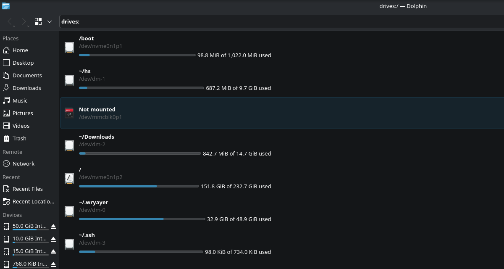
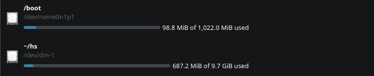

# dolphin-poweruse

A small fork of **[Dolphin](https://apps.kde.org/dolphin/)**, KDE's file
manager, with a handful of additions for people who live in their file manager:

* **[Custom context menu entries](#1-custom-context-menu-entries-split-by-kind)**
  you define yourself, kept apart for directories and for files
* **[A drive list at `drives:/`](#2-a-drive-list-at-drives)** showing what is
  mounted where and how full it is, with mounting straight from the list
* **[Faster copying of many small files](#3-copying-many-small-files-several-at-a-time)**,
  by keeping several operations in flight instead of one at a time



---

## About the original

Dolphin is written and maintained by the **KDE community**, and everything that
makes it a good file manager is their work. This repository is only a thin layer
on top of it:

* Upstream source: <https://invent.kde.org/system/dolphin>
* Homepage and downloads: <https://apps.kde.org/dolphin/>
* Report Dolphin bugs to KDE, not here: <https://bugs.kde.org/>
* The original readme is kept as [README.upstream.md](README.upstream.md)

This fork is **not affiliated with, nor endorsed by, KDE e.V. or the Dolphin
maintainers**. It is licensed **GPL-2.0-or-later**, the same as upstream, and
tracks a release tag rather than diverging: the changes here are deliberately
small and self-contained so they can be rebased onto each new Dolphin release.

If you want Dolphin itself, install it from your distribution — you do not need
this fork.

Current base: **v26.08.0**.

---

## What this fork adds

### 1. Custom context menu entries, split by kind

**Settings → Configure Dolphin… → Custom Actions** holds two independent lists:

| List | Shown when |
|---|---|
| When directories are selected | the selection is made of folders |
| When files are selected | the selection is made of files |

Each entry is a name, an icon and a command, and they appear in the context menu
in their own group. A selection mixing files and folders gets neither list,
since an entry written for one kind rarely fits the other.

Commands understand the usual placeholders:

| Placeholder | Becomes |
|---|---|
| `%f` | the path of the item |
| `%F` | the paths of every selected item |
| `%u`, `%U` | the same, as URLs |
| `%d` | the folder the item is in |

A command with none of them gets the paths appended, so `ark --add` works as
written. Everything is quoted, so names with spaces arrive as one argument.

The command field has a browse button: pick an executable and its path is filled
in, or pick a `.desktop` file and its `Exec` line, name and icon come along,
leaving only the parameters to type.

Entries live in `~/.config/dolphinrc` under `[CustomActions][Directories]` and
`[CustomActions][Files]`, and are read each time the menu opens.

### 2. A drive list at `drives:/`



`drives:/` is a folder holding one entry per drive, partition, removable disk
and container Solid knows about — LUKS and LVM volumes included. Each row shows

* the **mount point** first, with `/home/you` written as `~`,
* the **device node** underneath it,
* and a **usage bar** with the used and total size spelled out.

Devices that are not mounted say so and have no bar.

What you can do with a row:

| Action | Result |
|---|---|
| Double-click | opens it; an unmounted device is mounted first |
| Right-click | open, mount/unmount, copy the mount point or device node, properties |
| Properties | the usual dialog on the mount point, so its size is worked out for you |

Mounting goes through Solid, which asks **UDisks2** to mount as the current user
— no root — and an encrypted container asks for its passphrase at that point.

Because it is an ordinary URL, the list behaves like any other tab: split it,
bookmark it, or type it into the location bar.

```sh
dolphin --drives      # open the list in a tab
dolphin drives:/      # the same thing
```

The listing is a KIO worker installed as `kf6/kio/kio_drives.so`, so `drives:/`
also works in other KDE applications.

### 3. Copying many small files, several at a time

Dolphin copies through `KIO::CopyJob`, which is strictly serial: the next file
starts only once the previous one has come back from the worker process. The
per-file work is already about as good as it gets — reflink, `copy_file_range`,
extended attributes, ACLs, timestamps, and a `.part` file so an interrupted copy
cannot leave a truncated one — but with thousands of small files the disk spends
most of its time waiting for the next round trip.

This fork keeps several file operations in flight instead. Measured here on an
NVMe machine with 8 cores, copying into a fresh directory:

| | 3000 × 4 KiB, ext4 | 2000 × 8 KiB, encrypted volume |
|---|---|---|
| Stock `KIO::CopyJob` | 566 ms / 734 ms | 524 ms |
| 2 in flight | 277 ms / 222 ms | 177 ms |
| 4 in flight | 267 ms / 235 ms | 173 ms |
| 8 in flight | 279 ms / 231 ms | 167 ms |
| 16 in flight | 247 ms / 222 ms | 170 ms |

Two runs are shown for ext4 to give an idea of the spread; the stock figure
moves around more than the concurrent ones do. That is **roughly two and a half
to three times faster**, and worth being precise about where it comes from:
essentially all of the gain is already there with **2** operations in flight,
and 4, 8 and 16 land within noise of each other. The device is not short of
bandwidth for 4 KiB files — it is waiting on round trips, and two in flight is
enough to keep it busy. The default is 4, comfortably past the knee without
queueing more work than a slow or rotational disk would enjoy.

What did **not** help, and was tried: reading batches of files into memory and
writing them out afterwards. It doubles the memory traffic, removes the overlap
between reading and writing, and for small files the copy never reaches
user space to begin with.

Each file is still copied by KIO's own worker, so every property listed above is
preserved exactly as before, and undo, progress and error reporting behave the
same. The job steps aside and hands the whole operation to the ordinary
`KIO::copy()` — before touching anything — when it cannot do better:

* something already exists at the destination, so the usual overwrite, rename
  and skip dialogs apply,
* a source is a symlink or something other than a plain file or directory,
* a source or the destination is not local (`sftp://`, `admin://`, archives…),
* or there are fewer files than the threshold, where batching costs more than it
  saves.

**Settings → Configure Dolphin… → Copying** turns it off or tunes it, and the
same values live in `dolphinrc`:

```ini
[PowerCopy]
Enabled=true
FilesInFlight=4
MinimumFiles=8
```

Buffer sizes are deliberately not exposed: the measurements above show the win
comes from concurrency, and for small files KIO uses `copy_file_range()`, which
never allocates a user-space buffer at all — there is no buffer left to size.

---

## Install

```sh
./install-poweruse.sh                # build and install over the packaged Dolphin
./install-poweruse.sh --set-default  # ...and make it the handler for folders
./uninstall-poweruse.sh              # put the distribution's Dolphin back
```

The installer targets **Arch Linux**. It asks for your sudo password, installs
the build dependencies, and installs the `dolphin` package first if it is
missing — that package pulls in every library this build needs at runtime, and
gives the uninstaller something to restore. Before the first install it tars up
every file the package owns into `/var/lib/dolphin-poweruse/`.

Options:

```
-j <n>          parallel build jobs
--set-default   register Dolphin as the handler for folders
--no-build      install what is already in build/
--no-hook       skip the pacman upgrade-warning hook
```

On another distribution, build it the usual way and install wherever your
Dolphin lives:

```sh
cmake -B build -DCMAKE_BUILD_TYPE=Release -DCMAKE_INSTALL_PREFIX=/usr
cmake --build build
sudo cmake --install build
```

## Working on it

```sh
git switch custom     # the branch holding these changes
# edit, then:
./install-poweruse.sh # rebuilds incrementally and installs
```

Moving to a newer Dolphin is a rebase onto the new tag:

```sh
git fetch upstream
git rebase v26.08.1 custom
./install-poweruse.sh
```

The changes are kept as a thin patch on purpose. New code lives in
`src/customactions.{h,cpp}`, `src/settings/customactions/`, `src/drives/` and
`src/kioworkers/drives/`; upstream files only gain a call, a settings page
registration, the `--drives` option and their entries in `CMakeLists.txt`.

## Caveats

* Upgrading the `dolphin` package overwrites this build. The pacman hook
  installed here prints a reminder; re-run `install-poweruse.sh` afterwards.
* `pacman -Qkk dolphin` reports the files as modified. That is expected.
* `uninstall-poweruse.sh` restores by reinstalling the package, which is the
  cleanest way back; the tarball in `/var/lib/dolphin-poweruse/` is the fallback
  if the package is gone.

## License

GPL-2.0-or-later, inherited from Dolphin. See [LICENSES/](LICENSES) for the full
texts, and the upstream project for the copyright of everything this fork is
built on.
